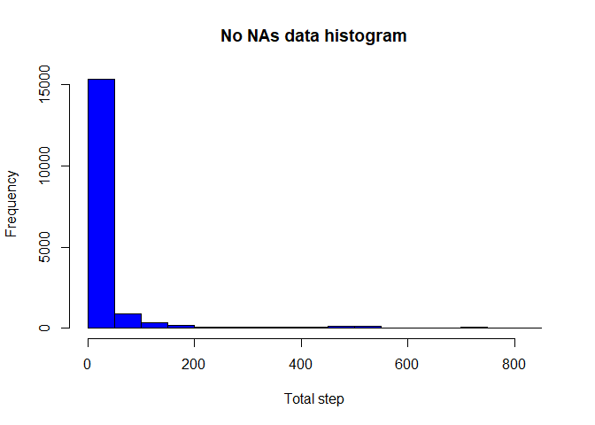

Reproducible Research: Peer Assessment 1
================
vh42720
August 29, 2017

Loading required packages

``` r
library(statsr)
library(dplyr)
```

    ## Warning: package 'dplyr' was built under R version 3.4.1

    ## 
    ## Attaching package: 'dplyr'

    ## The following objects are masked from 'package:stats':
    ## 
    ##     filter, lag

    ## The following objects are masked from 'package:base':
    ## 
    ##     intersect, setdiff, setequal, union

``` r
library(ggplot2)
```

    ## Warning: package 'ggplot2' was built under R version 3.4.1

``` r
library(lubridate)
```

    ## Warning: package 'lubridate' was built under R version 3.4.1

    ## 
    ## Attaching package: 'lubridate'

    ## The following object is masked from 'package:base':
    ## 
    ##     date

Loading the data and transform data into suitable classes

``` r
unzip("./repdata%2Fdata%2Factivity.zip")
activity <- read.csv("activity.csv")
activity$date <- ymd(as.character(activity$date))
```

What is the mean total of steps taken per day? 1.Calculate the total number of steps taken per day 2.If you do not understand the difference between a histogram and a barplot, research the difference between them. Make a histogram of the total number of steps taken each day 3.Calculate and report the mean and median of the total number of steps taken per day

``` r
date_steps <- activity %>%
        group_by(date) %>%
        filter(!is.na(steps)) %>%
        summarize(total=sum(steps))%>%
        print()
```

    ## Warning: package 'bindrcpp' was built under R version 3.4.1

    ## # A tibble: 53 x 2
    ##          date total
    ##        <date> <int>
    ##  1 2012-10-02   126
    ##  2 2012-10-03 11352
    ##  3 2012-10-04 12116
    ##  4 2012-10-05 13294
    ##  5 2012-10-06 15420
    ##  6 2012-10-07 11015
    ##  7 2012-10-09 12811
    ##  8 2012-10-10  9900
    ##  9 2012-10-11 10304
    ## 10 2012-10-12 17382
    ## # ... with 43 more rows

Histogram of steps taken per day

``` r
hist(date_steps$total, main = "Total steps per day",
     xlab = "Total steps", ylab = "Frequency", col = "blue")
abline(v=mean(date_steps$total,na.rm = T), col="red", lwd = 5)
```


The mean and median of the total number of steps taken per day

``` r
summary(date_steps$total)
```

    ##    Min. 1st Qu.  Median    Mean 3rd Qu.    Max. 
    ##      41    8841   10765   10766   13294   21194

What is the average daily activity pattern?

1.Make a time series plot (i.e. type = "l") of the 5-minute interval (x-axis) and the average number of steps taken, averaged across all days (y-axis) 2.Which 5-minute interval, on average across all the days in the dataset, contains the maximum number of steps?

We get the needed data for the interval

``` r
interval_steps <- activity %>%
        group_by(interval) %>%
        filter(!is.na(steps)) %>%
        summarize(average_steps = mean(steps)) %>%
        print()
```

    ## # A tibble: 288 x 2
    ##    interval average_steps
    ##       <int>         <dbl>
    ##  1        0     1.7169811
    ##  2        5     0.3396226
    ##  3       10     0.1320755
    ##  4       15     0.1509434
    ##  5       20     0.0754717
    ##  6       25     2.0943396
    ##  7       30     0.5283019
    ##  8       35     0.8679245
    ##  9       40     0.0000000
    ## 10       45     1.4716981
    ## # ... with 278 more rows

``` r
max <- max(interval_steps$average_steps)
interval_max<-interval_steps[interval_steps$average_steps==max,]
print(paste0("The interval that contains the maximum number of step is ",interval_max$interval))
```

    ## [1] "The interval that contains the maximum number of step is 835"

Plot the time series for the average steps per 5 minutes interval. we denote the max interval as the red dot on the graph

``` r
ggplot(data=interval_steps, aes(x=average_steps, y=interval))+
        geom_line()+
        geom_point(data = interval_max, col="red", lwd=5)+
        labs(title="Time series average steps across dates for 5 minutes interval",
              x= "Average Steps", y= "interval")
```


Imputing missing values

Note that there are a number of days/intervals where there are missing values (coded as NA). The presence of missing days may introduce bias into some calculations or summaries of the data.

1.Calculate and report the total number of missing values in the dataset (i.e. the total number of rows with NAs) 2.Devise a strategy for filling in all of the missing values in the dataset. The strategy does not need to be sophisticated. For example, you could use the mean/median for that day, or the mean for that 5-minute interval, etc. 3.Create a new dataset that is equal to the original dataset but with the missing data filled in. 4.Make a histogram of the total number of steps taken each day and Calculate and report the mean and median total number of steps taken per day. Do these values differ from the estimates from the first part of the assignment? What is the impact of imputing missing data on the estimates of the total daily number of steps?

Total number of NAs in the data

``` r
total_na <- sum(is.na(activity$steps))
print(paste0("The total of NAs is: ", total_na))
```

    ## [1] "The total of NAs is: 2304"

Let's fill the NA with the average steps of that day. We will use floor function to get the appropriated data.

``` r
data_no_na <- activity %>%
        group_by(date) %>%
        mutate(average_steps = mean(steps,na.rm=T))%>%
        mutate(average_steps = replace(average_steps, is.nan(average_steps),
                                       mean(activity$steps,na.rm=T))) %>%
        mutate(steps = replace(steps, is.na(steps), average_steps)) %>%
        print()
```

    ## # A tibble: 17,568 x 4
    ## # Groups:   date [61]
    ##      steps       date interval average_steps
    ##      <dbl>     <date>    <int>         <dbl>
    ##  1 37.3826 2012-10-01        0       37.3826
    ##  2 37.3826 2012-10-01        5       37.3826
    ##  3 37.3826 2012-10-01       10       37.3826
    ##  4 37.3826 2012-10-01       15       37.3826
    ##  5 37.3826 2012-10-01       20       37.3826
    ##  6 37.3826 2012-10-01       25       37.3826
    ##  7 37.3826 2012-10-01       30       37.3826
    ##  8 37.3826 2012-10-01       35       37.3826
    ##  9 37.3826 2012-10-01       40       37.3826
    ## 10 37.3826 2012-10-01       45       37.3826
    ## # ... with 17,558 more rows

Histogram of the new data set with NAs filled in.

``` r
hist(data_no_na$steps, main="No NAs data histogram", xlab = "Total step", col="blue")
```



We can look at the summary of the new data vs. old

``` r
summary(activity$steps)
```

    ##    Min. 1st Qu.  Median    Mean 3rd Qu.    Max.    NA's 
    ##    0.00    0.00    0.00   37.38   12.00  806.00    2304

``` r
summary(data_no_na$steps)
```

    ##    Min. 1st Qu.  Median    Mean 3rd Qu.    Max. 
    ##    0.00    0.00    0.00   37.38   37.38  806.00

We can see that by filling in these NAs, our data becomes extremely right skewed!

Are there differences in activity patterns between weekdays and weekends?

For this part the weekdays() function may be of some help here. Use the dataset with the filled-in missing values for this part.

1.Create a new factor variable in the dataset with two levels - "weekdays" and "weekends" indicating whether a given date is a weekday or weekend day. 2.Make a panel plot containing a time series plot (i.e. type = "l") of the 5-minute interval (x-axis) and the average number of steps taken, averaged across all weekday days or weekend days (y-axis). See the README file in the GitHub repository to see an example of what this plot should look like using simulated data.

We first want to set the type of day to the data

``` r
data_no_na <- data_no_na %>%
        mutate(type = ifelse(wday(date)==1 |wday(date)==7, 
               "weekend", "weekday")) %>%
        group_by(interval, type) %>%
        summarize(average_steps = mean(steps,na.rm=T)) %>%
        print()
```

    ## # A tibble: 576 x 3
    ## # Groups:   interval [?]
    ##    interval    type average_steps
    ##       <int>   <chr>         <dbl>
    ##  1        0 weekday      7.006569
    ##  2        0 weekend      4.672825
    ##  3        5 weekday      5.384347
    ##  4        5 weekend      4.672825
    ##  5       10 weekday      5.139902
    ##  6       10 weekend      4.672825
    ##  7       15 weekday      5.162124
    ##  8       15 weekend      4.672825
    ##  9       20 weekday      5.073235
    ## 10       20 weekend      4.672825
    ## # ... with 566 more rows

Now we can plot the time series of the steps vs interval with facet type.

``` r
ggplot(data_no_na, aes(x=interval, y=average_steps))+
        geom_line() +
        facet_grid(type ~ .) +
        labs(title="Differences in activity patterns between weekdays and weekends",
             x = "Interval", y= "Average Steps")
```


